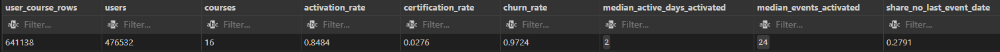
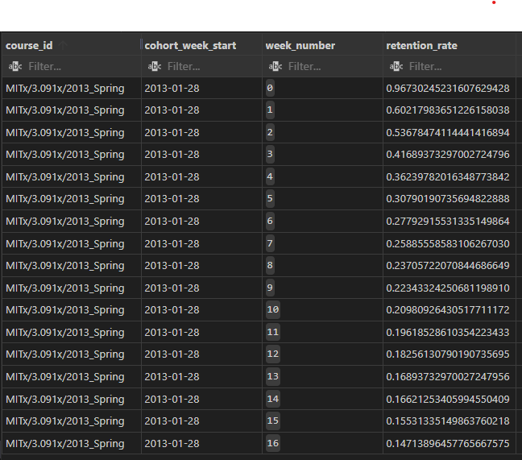

# SQL Analytics Warehouse for Online Course Engagement

## Project Overview

This project is a SQL-based analytics case study analysing user engagement, retention, and course completion for an online learning platform.

The dataset represents learner activity across multiple online courses, including enrolment dates, engagement metrics, and certification outcomes. The project is framed as simulated internal analytics work for an online education platform similar to Coursera or edX.

The objective of the analysis is to understand how learners engage with courses over time, how long they remain active, and which patterns of behaviour are associated with successful course completion. The project is intended to support learning experience teams in evaluating course performance and learner behaviour to improve course content and structure.


---

## Business Question

**How can we increase the number of learners who complete our course?**

### Key Findings

- A high proportion of learners activate initially (~85%), but relatively few go on to complete courses (~3% certification rate).
- Engagement behaviour is highly skewed: median active days is 2, and retention drops from ~97% in Week 0 to ~54% by Week 2.
- Certification is strongly associated with sustained engagement: near 0% for 8-14 active days vs ~24-74% for 15+ active days.
- Retention patterns vary meaningfully across courses, indicating course-specific design or learner-intent effects.

### Actionable recommendations (data-driven)

The largest opportunity is early sustained engagement: activation is ~85%, median active days is 2, and certification is ~3%. Given that students active 15+ days have a ~24%-74% completion rate, the first 2 weeks drive the biggest gains.

- Re-sequence Week 1 so the most rewarding or practical content appears in the first 20% of the course to address early churn.
- Insert a first 48 hours checklist (3-5 low-friction tasks) to convert high activation (~85%) into early sustained engagement rather than one-and-done activity.
- At the end of Days 1 and 2, highlight the value and time-to-complete of the next lesson to drive a second and third session.
- Launch a 14-day momentum streak and communicate that students active 15+ days show ~24%-74% completion vs near 0% below that threshold.
- Create a momentum streak leaderboard with a small reward (for example, a two-week milestone badge) for learners who keep a full 14-day streak.
- Add a first week success guide that sets expectations for required time and milestones, reducing early disengagement.
- Implement a return within 48 hours reminder during Week 1 to sustain the momentum streak in the most fragile period.

### How the analysis breaks down this question

To answer the core business question, the analysis investigates three specific areas:

1. **How many learners meaningfully engage with a course after enrolling?**  
   Impact: Identifies the activation bottleneck and whether the issue is enrolment drop-off or design-related disengagement.

2. **How does engagement depth relate to course completion and certification?**  
   Impact: Reveals whether engagement is predictive of outcomes, helping prioritise interventions on high-intent learners.

3. **How long do learners typically remain active after starting a course?**  
   Impact: Pinpoints critical drop-off windows where learners churn, informing intervention timing.
---

## Dataset

- **Source:** Public online course user engagement dataset [Link to Kaggle Dataset](https://www.kaggle.com/datasets/thedevastator/online-course-user-engagement-data)
- **Scope:** User-level engagement across multiple courses and course runs
- **Format:** Single CSV file ingested into PostgreSQL

The dataset required cleaning and validation before analysis, including type standardisation, date parsing, and normalisation of engagement flags.

---

## Getting Started: How to Run This Project

This section explains how to set up and run this analytics warehouse on your own system.

### Prerequisites

- PostgreSQL installed locally ([download here](https://www.postgresql.org/download/))
- `psql` (PostgreSQL command-line client, included with PostgreSQL)
- This repository cloned to your machine
- The `data/raw/Courses.csv` file present in the project

You can execute SQL using `psql` directly, or use any SQL IDE (VS Code, DBeaver, pgAdmin, etc.) that connects to PostgreSQL. Instructions below use `psql` for reproducibility across all platforms.

### Step-by-Step Setup

**1. Install PostgreSQL**
   - Download and install from [postgresql.org](https://www.postgresql.org/download/)
   - During installation, you'll create a password for the `postgres` superuser. Remember this
   - PostgreSQL will run as a local database server on your machine

**2. Connect to PostgreSQL via psql**
   - Open a terminal/command prompt and run:
     ```
     psql -U postgres
     ```
   - OR: launch SQL Shell (psql)
   - Run:
   ```
   CREATE DATABASE course_warehouse;
   ```
   - Connect to the course_warehouse database
   - Enter the superuser password when prompted
   - You should see the PostgreSQL prompt: `course_warehouse=#`

**3. Create schemas** (must be done first)
   - In the psql prompt, run:
     ```
     \i 'C:/path/to/project/sql/00_admin/00_create_schemas.sql'
     ```
   - Replace `C:/path/to/project/` with your actual project path
   - This creates the `raw`, `stg`, `analytics`, and `marts` schemas

**4. Create raw tables** (must be done before data load)
   - Still in psql, run:
     ```
     \i 'C:/path/to/project/sql/01_raw/01_create_raw_tables.sql'
     ```
   - This creates the empty `raw.course_user_engagement` table

**5. Load the CSV data** (only step using psql's \copy command)
   - Still in psql, run:
     ```
     \copy raw.course_user_engagement
     FROM 'C:/path/to/project/data/raw/Courses.csv'
     DELIMITER ','
     CSV HEADER;
     ```
   - Replace the file path with your actual project path
   - Note: `\copy` is a psql metacommand and must be run in psql (not a standard SQL statement)

**6. Build the remaining warehouse layers**
   - Execute all remaining SQL files in this order:
     - `sql/02_staging/stg_course_user_engagement.sql`
     - `sql/03_analytics/` (all dimension and fact files)
     - `sql/04_marts/` (all mart files)
     - `sql/99_checks/` (all data quality check files)
   - You can use psql or any SQL IDE. In psql, execute each file with: `\i 'path/to/file.sql'`

### Verifying Success

After all SQL files have been executed, verify the warehouse was built correctly:
```
\i 'path/to/project/sql/99_checks/00_smoke_test.sql'
```

If all checks pass with no errors, your warehouse is successfully built and ready for querying.

---

## Tools Used

- PostgreSQL (database engine)
- psql (command-line client)
- SQL (CTEs, window functions, cohort logic)
- Optional: Any SQL IDE (VS Code, DBeaver, pgAdmin, etc.)
- GitHub for version control

---

## Approach & Rigor

**Built with 6 automated data quality checks** to ensure analytical reliability:
- Row count validation across all layers
- Key uniqueness verification
- Null and domain constraint checks
- Date logic validation
- Metric sanity checks
- Retention-specific validation

## Data Cleaning and Preparation

The data was modelled using a layered analytics warehouse structure to reflect real-world analytics workflows.

### Key steps

- Preserved the raw dataset exactly as received to ensure reproducibility
- Cleaned and standardised data in a staging layer:
  - Parsed dates from inconsistent formats
  - Converted engagement metrics stored as text into numeric fields
  - Normalised boolean flags
- Built analytics models on top of cleaned data to define:
  - User–course lifecycles
  - Engagement and activation logic
  - Churn and completion outcomes
- Added data quality checks to validate row counts, key uniqueness, date logic, and metric consistency

This approach ensures that analytical outputs are reliable and auditable.

---

## Analytical Approach

Each row in the analytics layer represents a **single learner’s lifecycle within a single course**.

Courses are treated as subscription-like experiences with:
- a start date
- an observed end of activity
- an outcome (certified or not)

Retention is measured using a **survival-style approach**, based on how long learners remain active after starting a course. Because the dataset only includes start and last activity dates, retention reflects *engagement longevity* rather than week-by-week activity.

---

## Key Outputs and Visual Evidence

Below are selected outputs generated directly from SQL models.

### Overall platform KPIs



Key metrics:
- Activation rate: ~85%
- Certification rate: ~3%
- Churn rate (non-certification by course end): ~97% (1 - Certification Rate)
- Median active days among activated learners: 2

---

### Weekly retention (example course)



Key metrics:
- Retention rate drops from ~97% in Week 0 to ~54% by Week 2, a drop of ~43%

This table shows survival-style retention for a single course cohort, illustrating sharp early drop-off followed by a smaller group of long-running learners.

---

### Engagement depth vs outcomes


Key metrics:
- Certification rate is near 0% for 8-14 active days.
- Certification rate rises to ~24%-74% for 15+ active days.

Learners with higher sustained engagement show markedly higher certification rates, suggesting a strong relationship between early and ongoing activity and successful outcomes.

---

## Project Value

This project demonstrates the ability to:

- Design and implement a SQL-based analytics warehouse
- Model user lifecycles, retention, and churn using imperfect real-world data
- Apply cohort and survival analysis concepts appropriately
- Build reproducible, well-structured analytical workflows
- Communicate analytical results clearly and honestly

---

## Repository Contents

- `data/` – Raw source dataset
- `sql/`
  - `00_admin/` – Schema and setup
  - `01_raw/` – Raw data ingestion
  - `02_staging/` – Cleaning and standardisation
  - `03_intermediate/` – Facts and dimensions
  - `04_marts/` – Final analytical outputs
  - `99_checks/` – Data quality and sanity checks
- `screenshots/` – Visual evidence of key outputs
- `README.md` – Project overview and findings